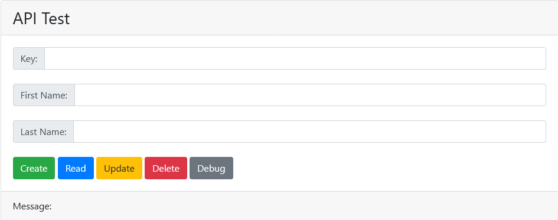

# FullStack Tutorial

In this fullstack tutorial, I will implement a simple CRUD App, including:
- A [Frontend](https://jiangyiqun.github.io/fullstack_tutorial/) using [JavaScript(React)](https://reactjs.org/)
- A [Backend](./docs/README.md) using [Python(Flask)](https://flask.palletsprojects.com/en/1.1.x/)

This CRUD App can manipulate a database which include a key and a pair of names, as follows:

___

## Implementation

One of the fancy part of web app is that it is seperated by layers.

- The top layer is [frontend](./frontend), which utilises the [APIs](./docs) provided by backend. When implementing [frontend](./frontend), we can assume that all the [APIs](./docs) has already been implemented.
- The middle layer is [backend](./backend), which utilises the functions in [Model layer](./backend/dbms) to manipuate database. When implementing [backend](./backend), we assume that all the functions in [Model layer](./backend/dbms) has already been implemented.
- The bottom layer is [Model layer](./backend/dbms), which includes the implementation of manipulating database. I have provided a few implementations, they all have the same fuction interface.

You may start from any layer you prefer. If not sure, I recommend you to look at [APIs](./docs) first.